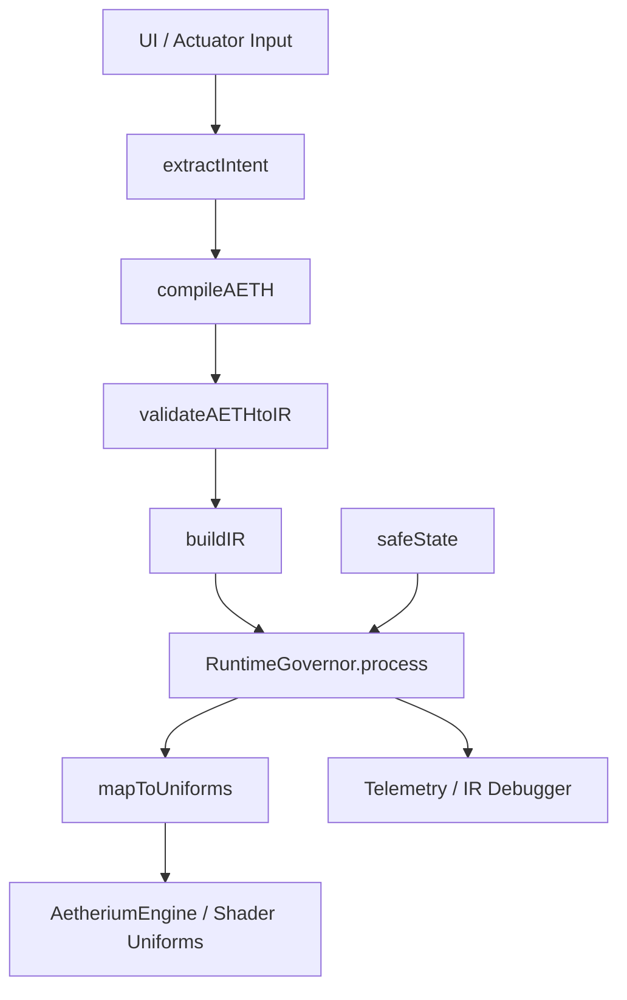

# Aetherium Manifest

Aetherium Manifest is a browser-native **intent-to-photonic** simulation runtime where light acts as the computational substrate. User input is parsed into an intent vector, transformed into an 8D manifold state, then rendered as governed particle behavior through WebGL/Three.js.

## Core Runtime Flow

`User Input → Intent Vector → 8D Manifold → Simulation → Photonic Collapse`

The runtime pipeline is designed around four state transitions:

1. **LISTENING**
2. **THINKING**
3. **RESONATING**
4. **RESPONDING**

Each transition is intended to carry:
- duration
- easing
- energy shift

## Intent Vector Schema

Incoming messages are resolved into intent features that drive morphology:

```json
{
  "intent_category": "greeting | question | creation | destruction | search | calm | complex | default",
  "emotional_valence": "-1.0..1.0",
  "uncertainty": "0.0..1.0",
  "urgency": "0.0..1.0"
}
```

## 8D Manifold Canonical State

The governed scene evolves within an 8D state contract:

- `(x, y, z)` → spatial anchor
- `intent` → system state
- `confidence` → probability field
- `energy` → kinetic expression
- `coherence` → structural stability
- `policy_risk` → constraint boundary

## AETH Contract

All manifestation behavior should follow:

- **IF** `[state condition]`
- **THEN** `[light behavior]`
- **BECAUSE** `[reasoning principle]`

## Governance Rules

- If `entropy > threshold` → activate **NIRODHA** stabilization.
- If `policy_risk` is high → clamp system output.
- Runtime governor enforces bounded energy/turbulence for safe rendering.

## Simulation Engine Responsibilities

Instead of producing plain text answers, the engine should:

1. Build scene graph
2. Apply attractors and boundaries
3. Simulate particle interaction
4. Resolve conflicts via interference

## Architecture Scaffold (Implemented / Runtime Migration)

- `runtime/intent/extractIntent.ts` → `extractIntent(input) -> IntentVector`
- `runtime/agns/interpretIntent.ts` → `interpretIntent(intent) -> BrainState`
- `runtime/aeth/compileAETH.ts` → `compileAETH(brainState) -> AETHContract`
- `runtime/ir/buildIR.ts` → `buildIR(aeth, brainState) -> PresenceIR`
- `runtime/governor/governor.ts` → `governor.process(ir) -> GovernedIR`
- `runtime/gpu/uniforms.ts` → `mapIRToUniforms(ir) -> UniformMap`
- `runtime/gpu/adapter.ts` → renderer/material integration boundary
- `runtime/runtime/pipeline.ts` → orchestration through `AetherPipeline.run()`
- `runtime/engine/AetheriumEngine.ts` → runtime orchestration entrypoint
- `engine/renderer.js` → minimal render stub
- `ui/controller.js` → UI orchestration layer
- `main.js` → runtime entrypoint (`runManifest`)

## Current Front-End Runtime Features

- Three.js shader-driven particle field (`vertex` + `fragment` shaders)
- HUD telemetry for IR/state visibility
- Key-gated provider connection modal (Anthropic API)
- Demo mode fallback with local intent classification
- Governed IR → GPU uniform mapping (`uEnergy`, `uTurbulence`, `uFlow`, etc.)
- Overlay-based manifestation feedback (`INTENT_CLASS` + descriptor)


### Canonical IR Contract (Runtime)

`runtime/ir/ir.types.ts` defines a frozen scalar 8D IR contract:

```ts
{
  intent: Scalar01,
  coherence: Scalar01,
  entropy: Scalar01,
  energy: Scalar01,
  turbulence: Scalar01,
  flow: Scalar01,
  stability: Scalar01,
  phase: Scalar01
}
```

Normalization rules:

- `coherence = 1 - turbulence`
- `entropy = turbulence`
- `stability = 1 - turbulence`
- `flow`: `inward -> 0`, `outward -> 1`
- `phase`: `STRANGE_ATTRACTOR -> 0.7`, `EQUILIBRIUM -> 0.3`, default `0.5`

Extended telemetry is emitted in a separate debug envelope (`{ aeth }`) so the canonical IR object remains conformant.

## Specification Documents

Formal RFC-style specifications are available under `docs/spec/`:

- `000-overview.md`
- `010-architecture.md`
- `020-intent-vector.md`
- `030-aeth-dsl.md`
- `040-presence-ir.md`
- `050-governor-policy.md`
- `060-security-privacy.md`
- `070-telemetry.md`
- `080-conformance-profiles.md`
- `090-migration.md`
- `CHANGELOG.md`

## Notes

- API keys are intended to remain in session memory only.
- The system can run without an external provider in demo mode.

## Conformance Test Criteria

Deterministic test vectors are defined for unit and integration coverage:

- input IR → expected uniforms (`uMode`, `uEnergy`, `uTurbulence`, `uFlow`)
- invalid input (`NaN`, missing fields) → `safeState()` fallback
- overload case (`energy > 0.9 && turbulence > 0.6`) → turbulence damping policy

Numeric conformance uses tolerance **±0.01** for floating-point checks.

- governor clamps `energy`/`turbulence` via `runtime/governor/policies.ts::LIMITS` (`[0,1]` and `[0,0.7]`).
- overload rule: if `energy > 0.9 && turbulence > 0.6`, turbulence is damped to `0.4`.
- `safeState()` fallback is canonical: `{ intent:0, coherence:1, entropy:0, energy:0.2, turbulence:0, flow:1, stability:1, phase:"idle" }`.

Test files:

- `test/unit/governor.test.ts`
- `test/unit/pipeline.test.ts`
- `test/unit/uniforms.test.ts`
- `test/integration/webgl-pipeline.spec.ts`

## Migration Execution Artifacts

เอกสารสำหรับวางแผน migration เชิงปฏิบัติการอยู่ที่ `docs/migration/`:

- `docs/migration/matrix.md` — ตาราง Current Asset → Target Component → Action พร้อม dependency order, risk, rollback plan และสถานะงาน
- `docs/migration/checklist.md` — เช็กลิสต์ execution รายขั้นพร้อมสถานะ `not-started/in-progress/done`

## Runtime Stack Thesis (Cognition Before Rendering)

แนวทาง Runtime Stack ของ Aetherium Manifest ยืนยันหลักการว่า “ภาพที่สวยอย่างเดียวไม่พอ—ระบบต้องคิดก่อนแสดงผล” โดยหลีกเลี่ยงสถาปัตยกรรมทางลัดแบบ `UI → Shader → GPU` ที่ไม่มีการตีความความหมายและนโยบายกำกับกลาง.

### Why Direct UI→Shader Is Risky

สถาปัตยกรรมทางลัดมีความเร็ว แต่ขาดองค์ประกอบสำคัญต่อระบบ AI scale:

- ไม่มี validation layer
- ไม่มี semantic interpretation
- ไม่มี policy enforcement
- debug ยากเพราะไม่มี state กลางที่ inspect ได้

### Governed Runtime Pipeline

Runtime pipeline ที่แนะนำ:

`Intent → AGNS → AETH → IR → Governor → GPU`

การแยกชั้นนี้ทำให้เกิด separation ระหว่าง **cognition** (การตีความเจตนา) และ **rendering** (การแสดงผลจริง) พร้อมตรวจสอบย้อนกลับได้ในทุกช่วง.

| Layer | Responsibility |
| --- | --- |
| Intent | รับ input ดิบ |
| AGNS | ตีความความหมายและเจตนา |
| AETH | แปลงเป็นกฎการแสดงผลเชิง declarative |
| IR | state กลาง (source of truth) |
| Governor | บังคับนโยบายความปลอดภัย/เสถียรภาพ |
| GPU | ประมวลผลและเรนเดอร์ภาพ |

### IR as Ontology (8D World State)

Presence IR ไม่ใช่แค่ data payload แต่เป็น ontology ของระบบสำหรับ simulation:

```ts
{
  intent,
  coherence,
  entropy,
  energy,
  turbulence,
  flow,
  stability,
  phase
}
```

ค่าบางมิติเป็น coupling โดยตรง (`coherence` และ `stability` แปรผกผันกับ `turbulence`) เพื่อสะท้อนสถานะโลกเดียวกันในหลายแกน.

### AETH DSL as Visual Law

AETH ถูกออกแบบให้เป็น declarative law system มากกว่า config ธรรมดา:

```ts
{
  shape: "vortex",
  density: 0.8,
  turbulence: 0.5,
  flow: "inward",
  law: "STRANGE_ATTRACTOR"
}
```

ระบบจึง “นิยามกฎ” ก่อน แล้วปล่อยให้ runtime ตีความสู่พฤติกรรมแสงและอนุภาค แทนการสั่ง GPU ตรงแบบ imperative.

### Governor as Safety Constitution

Governor ควรทำหน้าที่เชิงรุก ไม่ใช่ clamp ค่าอย่างเดียว:

- บังคับขอบเขตเชิงนโยบาย เช่น `energy ∈ [0,1]`, `turbulence ∈ [0,0.7]`
- ใช้กฎเชิงเงื่อนไขเพื่อลดความไม่เสถียร เช่น overload damping เมื่อพลังงานสูงร่วมกับ turbulence สูง
- รองรับการส่งสถานะเสี่ยงกลับสู่ UI เพื่อให้เกิด observability แบบเรียลไทม์

### UI as Observability Surface

UI ของระบบควรเป็นหน้าต่างของ state machine (ไม่ใช่แค่ control panel) โดยแสดง transition เช่น `IDLE → PROCESSING → RESONATING → CRITICAL`, telemetry และ intent/blueprint logs เพื่อช่วยวินิจฉัย behavior ของ runtime.

### Frontier Roadmap

หากต้องการผลักไปสู่ระดับ infrastructure:

- เพิ่ม WebGPU compute pipeline สำหรับ particle simulation ระดับ 100k+
- สร้าง parser + validator ของ AETH ด้วย formal grammar
- เพิ่ม multi-agent intent fusion บน IR กลาง
- ใช้ physics-informed constraints ใน Governor
- เชื่อม telemetry เข้าสู่ ML feedback loop

## IR Runtime Invariant Validation + Semantic Checksums

ระบบ runtime now includes a dedicated invariant + semantic integrity layer so each frame is not only executable, but semantically consistent across pipeline boundaries.

### What was added

- **Runtime IR Validator** (`core/runtime/irValidator.js`)
  - Validates finite scalar bounds for `confidence`, `energy`, `coherence`, `turbulence`, `flow`, `policyRisk`.
  - Validates `anchor.x/y/z` are finite coordinates.
  - Enforces semantic coupling invariants:
    - `turbulence = 1 - coherence`
    - `flow = energy`
- **Semantic checksum between layers** (`core/runtime/semanticChecksum.js`)
  - Canonicalized SHA-256 checksum for each stage:
    - `intent`
    - `brainState`
    - `aeth`
    - `ir`
  - Emitted in `AetherPipeline.run()` return payload under `checksums`.
- **Hard fail on IR semantic invariant violation**
  - `AetherPipeline.run()` now validates IR immediately after `buildIR(...)`.
  - Violations throw a deterministic runtime error with all violated rules.

### Property-based testing (fast-check style)

Added `test/unit/ir-validator.property.test.ts`:
- Generates randomized valid scalar frames in `[0,1]`.
- Constructs IR samples with mathematically valid coupling.
- Asserts validator always accepts valid frames over many runs.

This ensures the runtime evolves toward:

> “ไม่ได้แค่รันถูก”  
> “แต่ความหมายถูกต้องในทุกเฟรมของการคำนวณ”

## Runtime Stack Deepening Pack (Module Diagram + Line Review + Optimized HTML/JS)

ส่วนนี้ต่อยอดจากโค้ด HTML/JS ตัวอย่างที่ผู้ใช้ให้มา โดยสรุปเป็น 3 deliverables ครบถ้วน: (1) แผนภาพความสัมพันธ์โมดูล, (2) code review แบบ line-by-line, และ (3) เวอร์ชันปรับปรุงที่แก้ schema consistency + performance ของ Three.js uniforms.

### 1) Diagram ความสัมพันธ์ของโมดูล



**Dependency semantics**
- `extractIntent()` = normalization boundary ของ input ดิบ
- `compileAETH()` = visual contract synthesis
- `validateAETHtoIR()` = schema guard ก่อนเข้าด่าน policy
- `buildIR()` = canonical state synthesis
- `RuntimeGovernor.process()` = policy + safety constitution
- `mapToUniforms()` = CPU→GPU adapter
- `AetheriumEngine` = orchestration + render loop

### 2) Code Review เชิง line-by-line (ประเด็นหลัก)

> หมายเหตุ: อ้างอิงตามสคริปต์ตัวอย่างที่แนบมาในบทสนทนา (ไม่ใช่ไฟล์จริงใน repo)

1. `extractIntent(input)`
   - ✅ ดี: มี `clamp` ป้องกันค่าหลุดช่วงตั้งแต่ต้นทาง
   - ⚠️ ปรับเพิ่ม: ควร normalize `mode/type/source` ด้วย enum ที่ชัดเจน เพื่อลดค่าแปลก

2. `compileAETH(intent)`
   - ✅ ดี: แยก visual contract ออกจาก rendering runtime
   - ⚠️ ปรับเพิ่ม: `palette` ยังไม่ถูกใช้งาน downstream ควร map เข้า shader color policy

3. `buildIR(aeth)`
   - ⚠️ จุดซ้ำ semantic: `coherence` และ `stability` derive แบบเดียวกันจาก turbulence
   - ⚠️ จุดไม่สอดคล้อง schema: `intent` ใน IR ถูกแทนด้วย `glow` (เชิง visual) มากกว่าเจตนาจริง

4. `RuntimeGovernor.process(ir)`
   - ✅ ดี: clamp + overload damping + fallback
   - ⚠️ ปรับเพิ่ม: ตรวจ `Number.isFinite` ทุก field สำคัญ ไม่ใช่เฉพาะ `energy`

5. `mapToUniforms(ir)`
   - ✅ ดี: เป็น adapter ชัดเจน
   - ⚠️ ปรับเพิ่ม: รองรับ transition blend factor (เช่น `uBlend`) สำหรับ state transition นุ่มขึ้น

6. `injectIntent/reset()`
   - ⚠️ performance issue: `Object.assign(this.material.uniforms, { uMode: {value...} })` สร้าง object ใหม่ซ้ำ
   - ✅ ควรแก้: อัปเดต `this.material.uniforms.uMode.value = ...` โดยตรง

### 3) เวอร์ชันปรับปรุง (Schema + Performance Blueprint)

#### 3.1 Canonical IR schema (ปรับ)

```ts
{
  intent_type: "idle" | "manifest",
  intent_strength: number,     // 0..1
  confidence: number,          // 0..1
  coherence: number,           // 0..1
  entropy: number,             // 0..1
  energy: number,              // 0..1
  turbulence: number,          // 0..1
  stability: number,           // 0..1
  flow: -1 | 1,
  phase: "idle" | "manifest",
  source_trust: number         // 0..1
}
```

#### 3.2 Governor policy table (ตัวอย่าง)

```ts
const POLICY = {
  idle: { maxEnergy: 0.45, maxTurbulence: 0.25 },
  manifest: { maxEnergy: 1.0, maxTurbulence: 0.7 }
};
```

กฎเสริม:
- ถ้า `entropy > 0.85` → activate **NIRODHA** (`energy *= 0.8`, `turbulence *= 0.6`)
- ถ้า `source_trust < 0.3` → clamp `maxEnergy` ลงอีกชั้น

#### 3.3 Uniform update pattern (ปรับ perf)

```js
function applyUniforms(material, u) {
  material.uniforms.uMode.value = u.uMode;
  material.uniforms.uEnergy.value = u.uEnergy;
  material.uniforms.uTurbulence.value = u.uTurbulence;
  material.uniforms.uFlow.value = u.uFlow;
  material.uniforms.uTimeScale.value = u.uTimeScale;
}
```

#### 3.4 Transition blend (idle↔manifest)

เพิ่ม `uBlend` ใน shader แล้ว lerp พฤติกรรมแทน switch แข็ง:
- idle field = baseline motion
- manifest vortex = governed motion
- final `pos = mix(idlePos, manifestPos, uBlend)`

ผลลัพธ์:
- ลด visual snapping
- รองรับ state transitions: `LISTENING → THINKING → RESONATING → RESPONDING`

### AETH Contract Snapshot

- **IF** `phase = manifest` และ `energy > 0.8`  
  **THEN** เพิ่มความหนาแน่น particle + inward flow พร้อม turbulence แบบกำกับ  
  **BECAUSE** แสงทำหน้าที่เป็น substrate computation ภายใต้ขอบเขตความเสถียรของ Governor

- **IF** `entropy > threshold`  
  **THEN** เข้าสู่ NIRODHA damping state  
  **BECAUSE** ป้องกัน collapse ที่ไม่ปลอดภัยและรักษาโครงสร้าง manifold


## Deterministic Runtime Classification

`runtime/agns/interpretIntent.ts` now uses deterministic classification rules:

- `manifest` mode → `{ class: "ACTIVE", complexity: "HIGH|MEDIUM" }`
- fallback → `{ class: "IDLE", complexity: "LOW" }`

`runtime/aeth/compileAETH.ts` emits complete AETH law objects with:

- `shape`, `density`, `turbulence`, `flow`, `law`

Branch behavior:

- ACTIVE: `shape: "vortex"`, `density: 0.8 * intensity`, `turbulence: 0.3 + entropy * 0.4`, `flow: "inward"`, `law: "STRANGE_ATTRACTOR"`
- IDLE: `shape: "field"`, `density: 0.2`, `turbulence: 0.05`, `flow: "outward"`, `law: "EQUILIBRIUM"`
